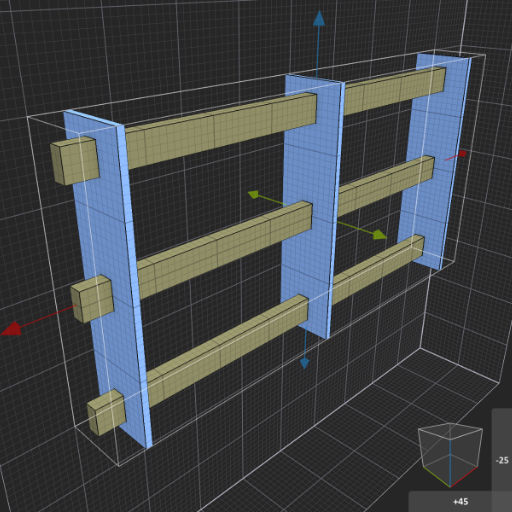

# MagicaVoxel Easy Fence shader
> 

> **To use this shader effectively, use the *'Voxel Shader Mode'* tool in the Brush panel to drag out a model cage. This will allow you to modify your object live, using the parameters.**

Easy Fence shader helps you create various fences in MagicaVoxel.

See the [introductory video](https://www.youtube.com/watch?v=F8h8Qt57CUs) on YouTube. **Make sure captions are enabled to see explanations!**

To install, download the *'mvs-easy-fence.txt'* file and place it into your *'MagicaVoxel > shader > custom'* folder. (If you don't have a *'custom'* folder inside your *'shader'* folder, you can either create the folder yourself or just place the file into the *'shader'* folder.)

## Parameters
**Orientation:** [0 - 3]  
Allows you to rotate the model in 90 degree increments. Depending on which 3D pane you create the model cage (X, Y, -X, -Y), you might see the model oriented incorrectly or facing outwards. Adjust this parameter to correctly orient the model.

**Post Count:** [0 - 255]  
The number of posts to use.

**Post Size:** [1- 255]  
Size of the posts.

**Post Spacing:** [1 - 255]  
Spacing between each post.

**Post Offset:** [-255 - 255]  
Offset/move the posts left or right by this amount.

**Rail Count:** [0 - 255]  
The number of rails to use.

**Rail Size:** [1 - 255]  
Size of the rails.

**Rail Spacing:** [1 - 255]  
Spacing between each rail.

**Rail Offset:** [-255 - 255]  
Offset/move the rails up or down by this amount.

**Rail Inset:** [0 - 255]  
Use this value to inset the rails from the posts. This will adjust how fat or thin the rails are going to be. If this value is zero (0), the rails will be as thick as the posts (or the model cage size). For more realistic effect, increase this value to make the rails thinner. This value will inset the rails from **both** directions (e.g. from front and back).

For example, if you have a post that is 4 voxels thick and you set this parameter to 1, the rails will be inset by 1 voxel from the back and 1 voxel from the front, making it 2 voxels thick.

Even though the maximum value of this parameter is 255, the maximum value you can inset the rail is determined by the size of the posts (or model cage size). For example, if you have a post that is 4 voxels thick and you set this value to 2, the rail would disappear since it would be thinner than 1 voxel. In this case the rail will stay at the minimum possible size and will not decrease further even if you increase the parameter value.

**Rail Color:** [1 - 255]  
Allows you to specify a separate color for the rails. You can see the color index value when you hover over a color in the palette. (The posts use the currently selected color in the palette. To change the color of the posts, select a different color from the palette.)

## Examples

