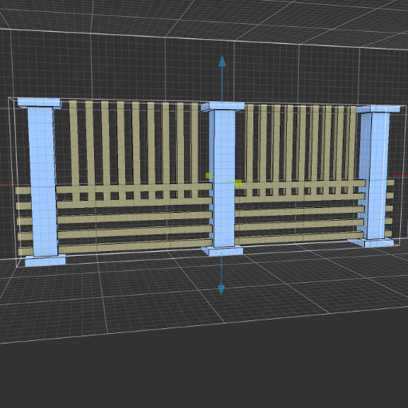

# MagicaVoxel Easy Fence shader
> 

> **To use this shader effectively, use the *'Voxel Shader Mode'* tool in the Brush panel to drag out a model cage. This will allow you to modify your object live, using the parameters.**

Easy Fence shader helps you create various fences in MagicaVoxel.

See the [introductory video](https://www.youtube.com/watch?v=F8h8Qt57CUs) on YouTube. **Make sure captions are enabled to see explanations!**

To install, download the *'mvs-easy-fence.txt'* file and place it into your *'MagicaVoxel > shader > custom'* folder. (If you don't have a *'custom'* folder inside your *'shader'* folder, you can either create the folder yourself or just place the file into the *'shader'* folder.)

## April 22, 2022: Picket fences are here! ##
As of version 1.2, you can create various picket fences. Create many unique designs of your favorite fences with a single stroke!

## Parameters
**Post Size:** [1- 255]  
Size of the posts.

**Post Spacing:** [1 - 255]  
Spacing between each post.

**Post Offset:** [-255 - 255]  
Offset/move the posts left or right by this amount.

**Cap Height:** [1 - 255]  
New in v1.1  
Adjust the post cap height. This will only have a visible effect if the *'Cap Inset'* parameter has a value greater than 1. See example images at the bottom.

**Cap Inset:** [0 - 255]  
New in v1.1  
Adjust the cap inset value. Cap inset adds a cap at the top and bottom of the post. When this value is zero (0), you get the simple rectangular post and the 'Cap Height' parameter will have no visible effect. See example images at the bottom.

**Picket Count:** [0 - 255]  
New in v1.2  
Allows you to set the number of pickets.

**Picket Size:** [0 - 255]  
New in v1.2  
The size (width) of the pickets.

**Picket Height Limit:** [0 - 255]  
New in v1.2  
Limits height of the pickets. This value will make the pickets this many voxels smaller from the top and bottom.

**Picket Offset:** [-255 - 255]  
New in v1.2  
Offset/move the pickets up or down by this amount.

**Picket Inset:** [0 - 255]  
New in v1.2  
Adjust the inset value of the pickets. This allows you to flush the pickets with the posts or rails, or even inset the pickets inside the rails to create truly unique variations. This value will inset the pickets from **both** directions (e.g. from front and back).

For example, if you set this parameter to 1, the pickets will be inset by 1 voxel from the back and 1 voxel from the front, making it 2 voxels thinner.

This value will have no visible effect once it reaches a limit where the inset value would make the picket disappear.

**Rail Count:** [0 - 255]  
The number of rails to use.

**Rail Size:** [1 - 255]  
Size of the rails.

**Rail Spacing:** [1 - 255]  
Spacing between each rail.

**Rail Offset:** [-255 - 255]  
Offset/move the rails up or down by this amount.

**Rail Inset:** [0 - 255]  
Use this value to inset the rails from the posts. This will adjust how fat or thin the rails are going to be. If this value is zero (0), the rails will be as thick as the posts (or the model cage size). For more realistic effect, increase this value to make the rails thinner. This value will inset the rails from **both** directions (e.g. from front and back).

For example, if you have a post that is 4 voxels thick and you set this parameter to 1, the rails will be inset by 1 voxel from the back and 1 voxel from the front, making it 2 voxels thick.

Even though the maximum value of this parameter is 255, the maximum value you can inset the rail is determined by the size of the posts (or model cage size). For example, if you have a post that is 4 voxels thick and you set this value to 2, the rail would disappear since it would be thinner than 1 voxel. In this case the rail will stay at the minimum possible size and will not decrease further even if you increase the parameter value.

**Rail Color:** [1 - 255]  
Allows you to specify a separate color for the rails. You can see the color index value when you hover over a color in the palette. (The posts use the currently selected color in the palette. To change the color of the posts, select a different color from the palette.)

## Examples

## Examples for v1.1 - Cap Height and Cap Inset values.

## Examples for v1.2 - Pickets.

## Version History
Version 1.2 - April 2, 2022   
Pickets are here! Now you can create your favorite picket fences with unique styles!

Version 1.1 - March 27, 2022  
Adds post cap. You can adjust the cap size and inset.
